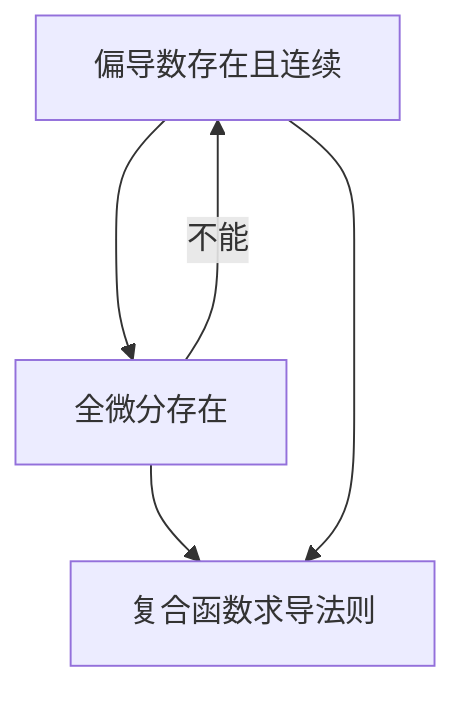

<!--
"setting": {
    "iffull":true,
    "background-color":"#b6949c",
    "font-color":"#f8f9fb"
}
-->

# 经典例子 [1^]
今天我们来学习复合函数的求导法则.

> **定理1**

对于函数 $f(u,v):\mathbb{R^2}\to\mathbb{R}$，以及函数 $u(x,y):\mathbb{R}^2\to\mathbb{R}$ 和 $v(x,y):\mathbb{R^2}\to\mathbb{R}$，若函数 $f$ 在 $(u_0,v_0)=(u(x_0,y_0),v(x_0,y_0))$ 处各个偏导数均存在且连续，函数 $u,v$ 在 $(x_0,y_0)$ 处各个偏导数都存在，记 $g(x,y)=f(u(x,y),v(x,y))$，那么有 $$\dfrac{\partial g}{\partial x}(x_0,y_0)=\dfrac{\partial f}{\partial u}\dfrac{\partial u}{\partial x}(x_0,y_0)+\dfrac{\partial f}{\partial v}\dfrac{\partial v}{\partial x}(x_0,y_0)$$

> **定理2**

对于函数 $f,g$，若 $f$ 在 $Y_0=g(X_0)$ 可导（全微分），$g$ 在 $X_0$ 可导，那么 $f\circ g$ 也在 $X_0$ 可导，且导数为 $$f'(Y_0)g'(X_0)$$

可以知道**定理2**如果写成矩阵的形式，可以推出**定理1**，但定理2事实上没有定理1苛刻，定理一不仅保证了全微分的存在性，还要求了偏导数的连续性，事实上，这个命题用到的仅仅是全微分的存在性，偏导数连续属于一个更强的条件，是充分的.

可以看出来根本性在于全微分的存在性.
下面贴一个 B 站可参考的全微分讲解视频：

https://www.bilibili.com/video/BV1wj9sYmEfo/?spm_id_from=333.337.search-card.all.click

下面再贴一个油管的全微分参考视频：

https://www.youtube.com/watch?v=ChoArVJnSjQ

作为对比，B 站视频和油管视频有以下特点：[2^]

|Bilbili|Youtube|
|----|----|
|不需要登陆|需要登陆|
|大部分为中文视频|不仅仅有中文视频|

[^1]: 这是一个用来展示 markdown 功能的全面的例子
[^2]: 这只是为了体现表格如何使用
